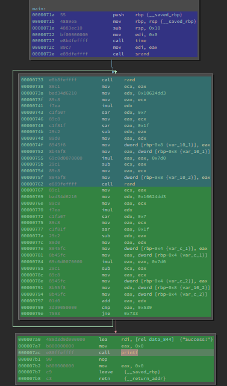
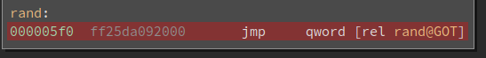

# Angr/Binja HeatMap
**Note: this is a work in progress, PRs and suggestions are welcomed and appreciated!**

## Installing
This project has a binary ninja plugin that you will need to put into your binary ninja plugin directory. 

## Using:
1) On binja start the plugin by selecting Tools > binja heat map
2) Use angr as you normally would, when you're ready to visuzlise the progress of your simulation manager use the following 
lines of code: 
```python
from  angr_heat_map_explorer import HeatMapExplorer
# normal angr magic to get a simulation manager 
hme = HeatMapExplorer()
simgr.use_technique(hme)
simgr.explore(target = your_target, avoid = your_avoid) 
```

3) Thats it, you should now be able to visualize your angr progress

## Example
In this example we will load a binary that generates two random numbers and when the sum of those numbers
is equal to 1337 it prints success and exits. 
```python 
import angr
from  angr_heat_map_explorer import HeatMapExplorer
# base addr is 0 so the addresses in binja and angr align 
proj = angr.Project(path_to_bin, load_options={'main_opts':{'base_addr':0}
# start address is the address of main, in case you compile the example for yourself
state = proj.factory.call_state(addr=0x71a)
simgr = proj.factory.simgr(state)
exp = HeatMapExplorer() 
simgr.use_technique(exp)
simgr.explore(find=0x7b8, num_find=1)
# now you should have a pretty heat map 
# important for now... you'll need to call _del_ on exp to close the socket
exp.__del__()
```
## heat map for main function

## heat map for rand function


# Notes and gotchas: 
1) You need to restart the plugin each time you close a connection 
2) The plugin communicates with angr over port 31337 so if its in use feel free to edit the code

